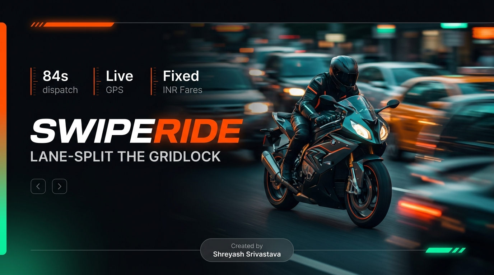
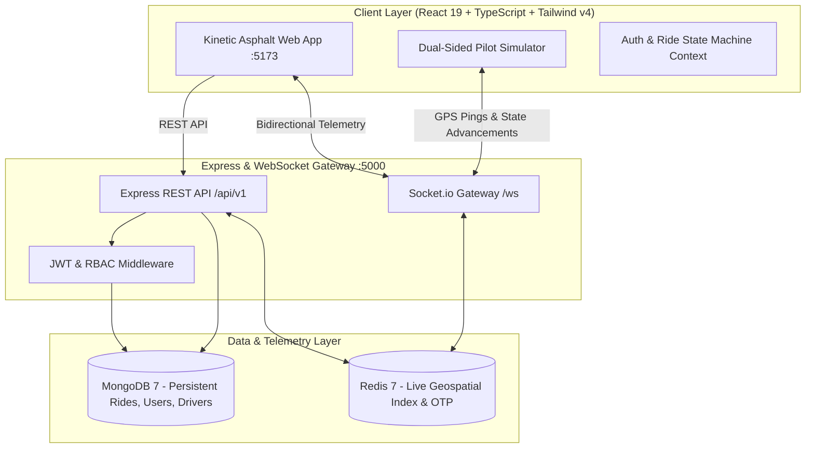

# SwipeRide 🏍️
### *High-Velocity Motorcycle Ride-Hailing & Street Dispatch Platform*



<p align="center">
  
</p>

[](https://nodejs.org)
[](https://expressjs.com)
[](https://mongodb.com)
[](https://redis.io)
[](https://react.dev)
[](https://typescriptlang.org)
[](https://tailwindcss.com)
[](https://socket.io)
[](https://jestjs.io)

---


## 🚦 Overview

**SwipeRide** is a production-grade, real-time motorcycle ride-hailing and courier dispatch engine engineered to lane-split through heavy urban traffic gridlocks in major Indian metropolitan hubs (Bengaluru, Mumbai, Delhi-NCR, Hyderabad). 

When 4-wheel cars sit stationary for 2+ hours in bumper-to-bumper peak hour traffic, SwipeRide motorcycles filter through at 40–50 km/h with low-latency Redis geospatial dispatch, live 10Hz GPS telemetry, certified dual ISI/DOT helmets, and transparent per-km INR (`₹`) pricing.

---

## ⚡ Key Highlights & Capabilities

- 📍 **Sub-Second Redis Geospatial Matching**: Queries live pilot coordinates with radial radius expansion, auto-dispatching the highest-rated nearby motorcycle in under 90 seconds.
- ⚡ **Real-Time WebSocket State Machine (`/ws`)**: Full bidirectional synchronization across all ride lifecycle states (`pending` → `accepted` → `inProgress` → `completed` / `canceled`).
- 💰 **Transparent INR Pricing**: Guaranteed fixed fares calculated using real distance matrices (Base ₹30 + ₹12/km) with no hidden surge fees.
- 🪖 **Safety Shield & Dual Helmets**: Strict enforcement of ISI/DOT certified helmets with sanitized hygiene liners and verified RTO/Police background vetting for all pilots.
- 🛵 **3 Specialized Fleet Tiers**:
  - **Moto Swift** (110–150cc agility for single commuters)
  - **Cargo Box** (45L weather-sealed lockable courier trunk)
  - **Volt EV** (Zero-emission electric cruisers like Ather & Ola)
- 🎮 **Dual-Sided Pilot Simulator Dock**: In-browser floating console allowing developers and reviewers to simulate the driver's perspective (Go Online, receive dispatch, accept, mark arrival, start trip, complete mission, and collect 80% net wallet cut).
- 🛡️ **Hardened Multi-Role JWT Security**: Strict role-based access control (`user`, `driver`, `admin`) with bcrypt password hashing and Redis TTL-backed OTP engines.

---

## 🏗️ Architecture Diagram



---

## 🚀 Quick Start (Running with One Command)

### 1. Prerequisites
- **Node.js** (v18+)
- **Docker Desktop** (for Redis and MongoDB)

### 2. Start Redis & Mongo via Docker

```powershell
# From the project root
docker compose up -d
```

### 3. Run Backend & Frontend Together

```powershell
npm run dev:all
```

- **Backend API & WebSockets**: `http://localhost:5000`
- **Frontend Application**: `http://localhost:5173` (or `http://localhost:5000` for production build)

---

## 🧪 Automated Integration Tests

Run the full Jest test suite with 100% pass rate:

```powershell
npm test
```

```
PASS  tests/auth.test.js
PASS  tests/ride.test.js

Test Suites: 2 passed, 2 total
Tests:       14 passed, 14 total
Snapshots:   0 total
Time:        14.2 s
```

---

## ⚡ 1-Click Instant Demo Credentials

The frontend includes 1-click demo buttons in the **Sign In** modal:

| Role | Demo Credentials | Test Purpose |
| :--- | :--- | :--- |
| **⚡ Rider** | Phone: `+919800000001`<br>Password: `Password123!` | Request rides, track live telemetry, make multi-stop bookings, and rate pilots |
| **🏍️ Pilot (Driver)** | Email: `vikram.pilot@swiperide.in`<br>Password: `DriverPassword123!` | Accept rides, emit GPS coordinates, advance trip statuses, track 80% earnings |
| **🛡️ Ops Admin** | Email: `ops@swiperide.in`<br>Password: `AdminSuperPassword123!` | Fleet-wide analytics, driver verification, and incident management |

---

## 📖 API Endpoints Reference

### 🔐 Authentication (`/api/v1/auth`)
| Method | Endpoint | Description |
| :--- | :--- | :--- |
| `POST` | `/api/v1/auth/user/register` | Register a new passenger rider |
| `POST` | `/api/v1/auth/driver/register` | Register a motorcycle pilot (with RTO plate & DL) |
| `POST` | `/api/v1/auth/login` | Authenticate with phone/email + password |
| `POST` | `/api/v1/auth/otp/send` | Dispatch 6-digit OTP via Redis |
| `POST` | `/api/v1/auth/otp/verify` | Verify OTP code |

### 🛵 Ride Dispatch & Tracking (`/api/v1/rides`)
| Method | Endpoint | Description |
| :--- | :--- | :--- |
| `POST` | `/api/v1/rides` | Request a ride (Pickup + Multi-stop destinations) |
| `GET` | `/api/v1/rides/:id` | Fetch full ride telemetry by ID |
| `GET` | `/api/v1/rides/user/history` | Get passenger trip history & receipts |
| `PATCH` | `/api/v1/rides/status/:id` | Advance ride state (`accepted` → `inProgress` → `completed`) |
| `POST` | `/api/v1/rides/cancel` | Cancel an active ride request |

### ⭐ Pilot Ratings & Uploads
| Method | Endpoint | Description |
| :--- | :--- | :--- |
| `POST` | `/api/v1/ratings` | Submit 5-star rating, compliment badges, and review |
| `POST` | `/api/v1/upload` | Upload profile avatar / motorcycle image (Max 5MB) |

---

## 🗺️ Real-Time WebSocket Events (`/ws`)

| Event Name | Direction | Payload Description |
| :--- | :--- | :--- |
| `join` | Client → Server | `{ userId }` or `{ driverId }` to join private telemetry room |
| `driverLocationUpdate` | Driver → Server | `{ driverId, location: { lat, lng } }` |
| `requestRide` | Rider → Server | `{ pickupLocation, dropoffLocations, fare }` |
| `rideRequest` | Server → Driver | Dispatches nearby ride notification to pilot |
| `rideResponse` | Driver → Server | `{ rideId, accepted: true/false }` |
| `rideAccepted` | Server → Rider | Notifies rider that pilot is en route |
| `driverArrived` | Driver → Server | Notifies rider that pilot is at pickup location |
| `rideStarted` | Server → Rider | Emits trip status `inProgress` |
| `rideCompleted` | Server → Rider | Emits trip status `completed` & triggers rating modal |

---

## 🎨 Design System & Visual Tokens

The frontend is built upon a custom **Asphalt & Kinetic Street** design system:

- **Primary Background**: Asphalt Pitch (`#07090C`)
- **Card Panels**: Carbon Mesh (`#121620`)
- **Nitro Orange**: (`#FF5500`) — Primary actions & high-priority CTAs
- **Cyber Mint**: (`#00F0A0`) — Active telemetry, live statuses & GPS locks
- **Alert Amber**: (`#FFB800`) — Pilot simulator dock & warnings
---

## 👨‍💻 Created & Developed By

**Shreyash Srivastava**  
*Software Engineer @ [UpscaleTechSolutions](mailto:upscaletechsolution@gmail.com)*  
📧 **Personal Email**: [shreyashsr2004@gmail.com](mailto:shreyashsr2004@gmail.com)  
🐙 **GitHub**: [github.com/ShreyashSrivastavaa](https://github.com/ShreyashSrivastavaa)

*SwipeRide is an independent full-stack motorcycle ride-hailing platform architected and built by Shreyash Srivastava.*

### 🏢 Company Affiliation: UpscaleTechSolutions
*Building modern web experiences, autonomous agentic AI systems, and digital process automation for ambitious enterprises worldwide.*

- 📧 **Company Contact**: [upscaletechsolution@gmail.com](mailto:upscaletechsolution@gmail.com)
- 🌐 **Services**: AI Automation • Web Design & Development • Agentic AI Systems • AI Strategy & Consulting • Enterprise Architecture

---

## 📄 License
MIT License. Created by **Shreyash Srivastava** ([shreyashsr2004@gmail.com](mailto:shreyashsr2004@gmail.com)) for **SwipeRide**.


